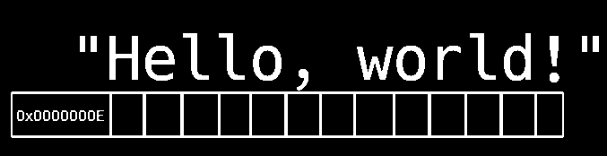

# These aren't C strings...
You'll need to pay a lot of attention to this explanation, as you may include undefined behavior in your program if you don't! Golem's strings are very special in that they store the size of the string internally within the 4 bytes ***before*** the character pointer. The size is stored as an unsigned 32-bit integer value. For reference, use the relatively primitive diagram below:

More to be added later!
